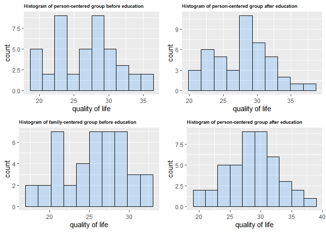
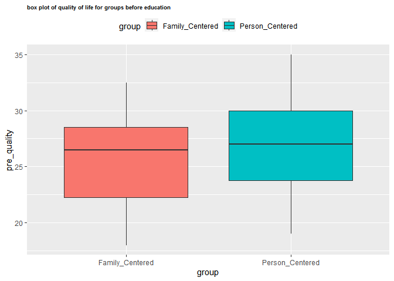
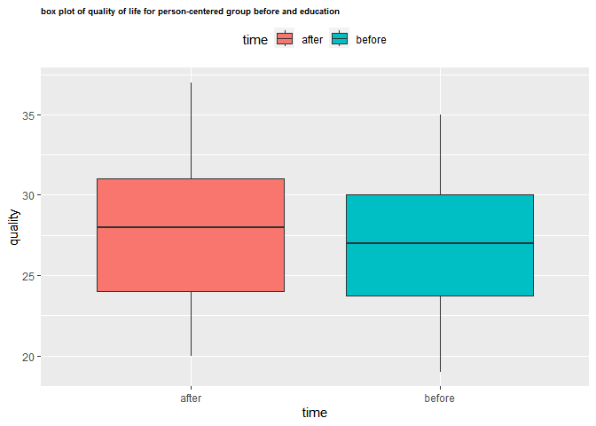
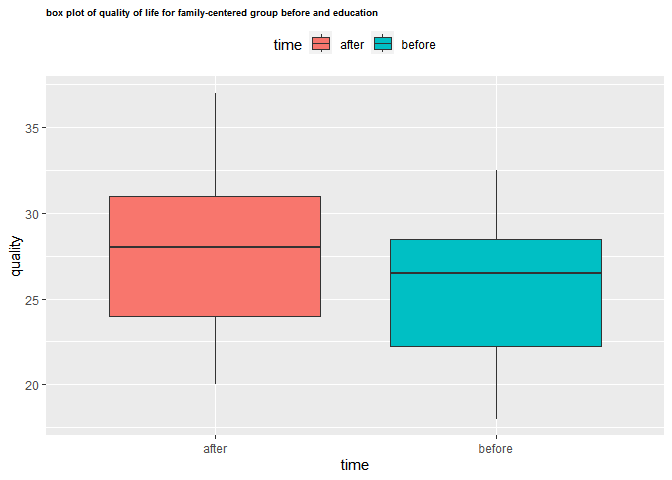
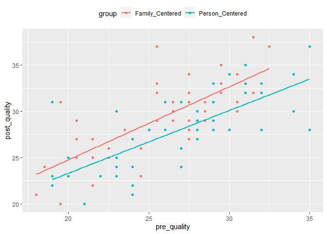
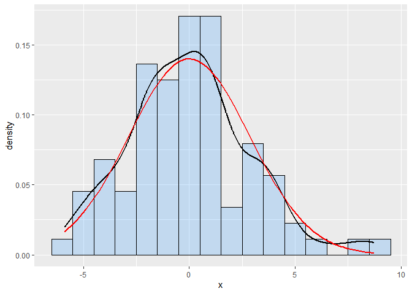
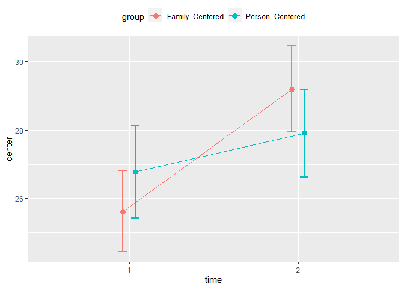

Comparison of Person-Centered and Family-Centered Education Methods in
Improving the Quality of Life of Patients with COVID-19
================
2023-11-20

\#Packages

``` r
library(readxl)
library(dplyr)
library(ggplot2)
library(tidyverse)
library(ggpubr)
library(rstatix)
library(broom)
library(gridExtra)
library(superb)
```

## Data

``` r
QOL <- read_excel("D:/My Documents/pdf/R/data.R/QOL.xlsx")
str(QOL)
```

    ## tibble [88 x 3] (S3: tbl_df/tbl/data.frame)
    ##  $ pre_quality : num [1:88] 35 29 24 32 25 34 35 31 25 29 ...
    ##  $ post_quality: num [1:88] 37 31 24 32 28 30 28 33 28 33 ...
    ##  $ group       : chr [1:88] "Person_Centered" "Person_Centered" "Person_Centered" "Person_Centered" ...

``` r
colnames(QOL)
```

    ## [1] "pre_quality"  "post_quality" "group"

\#summarize

``` r
pre_Person_Centered <- QOL %>% 
filter(group == "Person_Centered")%>%
summarise(mean = mean(pre_quality), sd = sd(pre_quality), 
min = min(pre_quality), max = max(pre_quality))

post_Person_Centered <- QOL %>% 
filter(group == "Person_Centered")%>%
summarise(mean = mean(post_quality), sd = sd(post_quality), 
min = min(post_quality), max = max(post_quality)) %>%
data.frame()

QOL_person <- rbind(pre_Person_Centered, post_Person_Centered) %>% data.frame()
rownames(QOL_person) = c("before education", "after education")
QOL_person
```

    ##                      mean       sd min max
    ## before education 26.77273 4.461013  19  35
    ## after education  27.90909 4.219656  20  37

``` r
pre_Family_Centered <- QOL %>% 
filter(group == "Family_Centered") %>%
summarise(mean = mean(pre_quality), sd = sd(pre_quality), 
min = min(pre_quality), max = max(pre_quality))


post_Family_Centered <- QOL %>% 
filter(group == "Family_Centered")%>%
summarise(mean = mean(post_quality), sd = sd(post_quality), 
min = min(post_quality), max = max(post_quality)) %>%
data.frame()

QOL_family <- rbind(pre_Family_Centered, post_Family_Centered) %>% data.frame()
rownames(QOL_family) = c("before education", "after education")
QOL_family
```

    ##                      mean       sd min  max
    ## before education 25.62500 3.901587  18 32.5
    ## after education  29.20455 4.140439  20 38.0

\#Histogram

``` r
p1 <- QOL %>% 
filter(group == "Person_Centered") %>%
ggplot(aes(x = pre_quality)) + 
geom_histogram(col = 'black', fill = 'dodgerblue', bins = 10, alpha = 0.2) +
labs(x = "quality of life") +
 ggtitle("Histogram of person-centered group before education") + theme(plot.title = 
 element_text(color = "black", face = "bold", size = 7))

p2 <- QOL %>% 
filter(group == "Person_Centered") %>%
ggplot(aes(x = post_quality)) + 
geom_histogram(col = 'black', fill = 'dodgerblue', bins = 10, alpha = 0.2) +
labs(x = "quality of life") +
 ggtitle("Histogram of person-centered group after education") + theme(plot.title = 
 element_text(color = "black", face = "bold", size = 7))


p3 <- QOL %>% 
filter(group == "Family_Centered") %>%
ggplot(aes(x = pre_quality)) + 
geom_histogram(col = 'black', fill = 'dodgerblue', bins = 10, alpha = 0.2) +
labs(x = "quality of life") +
 ggtitle("Histogram of family-centered group before education") + theme(plot.title = 
 element_text(color = "black", face = "bold", size = 7))


p4 <- QOL %>% 
filter(group == "Family_Centered") %>%
ggplot(aes(x = post_quality)) + 
geom_histogram(col = 'black', fill = 'dodgerblue', bins = 10, alpha = 0.2) +
labs(x = "quality of life") +
 ggtitle("Histogram of person-centered group after education") + theme(plot.title = 
 element_text(color = "black", face = "bold", size = 7))

grid.arrange(p1, p2, p3, p4, ncol = 2, nrow = 2)
```

<!-- -->

\#Box plot

``` r
ggplot(QOL, aes(x = group, y = pre_quality, fill = group)) + 
geom_boxplot(outlier.shape = NA) + 
theme(legend.position = "top") +
ggtitle("box plot of quality of life for groups before education") + theme(plot.title = 
 element_text(color = "black", face = "bold", size = 7))
```

<!-- -->

\#Independent t-test

``` r
variance_equality <- QOL %>% 
select(c("group", "pre_quality")) %>% 
 levene_test(pre_quality ~ group, data = .)
data.frame(variance_equality)
```

    ##   df1 df2 statistic         p
    ## 1   1  86 0.7610398 0.3854324

``` r
ind_t <- QOL %>% 
select(c("group", "pre_quality")) %>% 
 t.test(pre_quality ~ group, , var.equal = TRUE, data = .)


ind_t_result <- data.frame("person centered mean" = ind_t$estimate[[2]], 
"family centered mean" = ind_t$estimate[[1]], "df" = ind_t$parameter[[1]],
"statistic" = ind_t$statistic[[1]], "p-value" = ind_t$p.value)
ind_t_result
```

    ##   person.centered.mean family.centered.mean df statistic   p.value
    ## 1             26.77273               25.625 86 -1.284604 0.2023803

``` r
ifelse(ind_t_result$p.value > 0.05, "There is no significant difference between two groups", "There is a statistically significant 
difference between two groups")
```

    ## [1] "There is no significant difference between two groups"

\#paired t test for person-centered

``` r
paired_person <- t.test(QOL %>%
filter(group == "Person_Centered") %>%
pull(pre_quality), QOL %>%
filter(group == "Person_Centered") %>%
pull(post_quality), paired = TRUE)

paired_person_result <- data.frame("mean difference" = paired_person$estimate[[1]], "df" = paired_person$parameter[[1]]
, "statistic" = paired_person$statistic[[1]], "p-value" = paired_person$p.value)
paired_person_result
```

    ##   mean.difference df statistic    p.value
    ## 1       -1.136364 43 -2.301663 0.02626215

``` r
ifelse(paired_person$p.value > 0.05, "There is no significant difference 
before and after education for person-centered group", 
"There is a significant difference before and after education for person-centered group")
```

    ## [1] "There is a significant difference before and after education for person-centered group"

\#Box plot

``` r
data.frame(quality = c(QOL %>%
filter(group == "Person_Centered") %>%
pull(pre_quality), QOL %>%
filter(group == "Person_Centered") %>%
pull(post_quality)), time = c(rep("before", 44), rep("after", 44))) %>% 
ggplot(aes(x = time, y = quality, fill = time)) + 
geom_boxplot()+
theme(legend.position = "top") +
ggtitle("box plot of quality of life for person-centered group before and education") + theme(plot.title = 
 element_text(color = "black", face = "bold", size = 7))
```

<!-- -->

\#Paired t-test for family-centered

``` r
paired_family <- t.test(QOL %>%
filter(group == "Family_Centered") %>%
pull(pre_quality), QOL %>%
filter(group == "Family_Centered") %>%
pull(post_quality), paired = TRUE)

paired_family_result <- data.frame("mean difference" = paired_family$estimate[[1]], "df" = paired_family$parameter[[1]]
, "statistic" = paired_family$statistic[[1]], "p-value" = paired_family$p.value)
paired_family_result
```

    ##   mean.difference df statistic      p.value
    ## 1       -3.579545 43 -8.229324 2.249366e-10

``` r
ifelse(paired_person$p.value > 0.05, "There is no significant difference 
before and after education for family-centered group", 
"There is a significant difference before and after education for family-centered group")
```

    ## [1] "There is a significant difference before and after education for family-centered group"

\#Box plot

``` r
data.frame(quality = c(QOL %>%
filter(group == "Family_Centered") %>%
pull(pre_quality), QOL %>%
filter(group == "Person_Centered") %>%
pull(post_quality)), time = c(rep("before", 44), rep("after", 44))) %>% 
ggplot(aes(x = time, y = quality, fill = time)) + 
geom_boxplot()+
theme(legend.position = "top") +
ggtitle("box plot of quality of life for family-centered group before and education") + theme(plot.title = 
 element_text(color = "black", face = "bold", size = 7))
```

<!-- -->

\#Ancova assumption \#Linearity

``` r
ggplot(QOL, aes(x = pre_quality, y = post_quality, color = group, fill = group)) + 
  geom_point() +
theme(legend.position = "top") + 
stat_smooth(method = "lm", se = FALSE) + 
theme(legend.position = "top") 
```

<!-- -->

\#Homogeneity of regression slopes

``` r
slope <- QOL %>% anova_test(post_quality ~ group * pre_quality) 
slope
```

    ## ANOVA Table (type II tests)
    ## 
    ##              Effect DFn DFd      F        p p<.05   ges
    ## 1             group   1  84 11.718 9.59e-04     * 0.122
    ## 2       pre_quality   1  84 95.419 1.69e-15     * 0.532
    ## 3 group:pre_quality   1  84  0.555 4.58e-01       0.007

``` r
ifelse(slope$p[3] > 0.05, "There is homogeneity of regression slopes", 
"There is homogeneity of regression slopes")
```

    ## [1] "There is homogeneity of regression slopes"

\#Normality of residuals

``` r
model <- lm(post_quality ~ pre_quality + group, data = QOL)
Normality <- model$residuals %>%
shapiro_test() %>%
data.frame()
Normality
```

    ##   variable statistic   p.value
    ## 1        . 0.9818501 0.2555653

``` r
ifelse(Normality$p.value > 0.05, "Residuals are normaly distributed", 
"Residuals are normaly distributed")
```

    ## [1] "Residuals are normaly distributed"

\#Residuals plot

``` r
resid <- data.frame(x = model$residuals)

resid %>%
ggplot(aes(x = x)) + 
geom_histogram(aes(y =..density..), color = "black", fill = 
"dodgerblue", binwidth = 1, alpha = 0.2) +
geom_density(linewidth = 0.8) +
stat_function(fun = dnorm, colour = "red", , linewidth = 0.8, args = 
list(mean = mean(resid$x), sd = sd(resid$x)))
```

<!-- -->

\#ANCOVA

``` r
ANCOVA <- QOL %>% anova_test(post_quality ~ pre_quality + group)%>%
get_anova_table()

ifelse(ANCOVA$p[2] < 0.05, "There is a statistically significant difference in quality of life score between the groups after education"
,"There is not a statistically significant difference in quality of life score between the groups after education")
```

    ## [1] "There is a statistically significant difference in quality of life score between the groups after education"

\#Error bar plot

``` r
superbPlot(QOL, 
    BSFactor  = "group", 
    WSFactor  = "time(2)",
    variables = c("pre_quality","post_quality"),
    plotStyle = "line"
) +
theme(legend.position = "top")
```

<!-- -->
